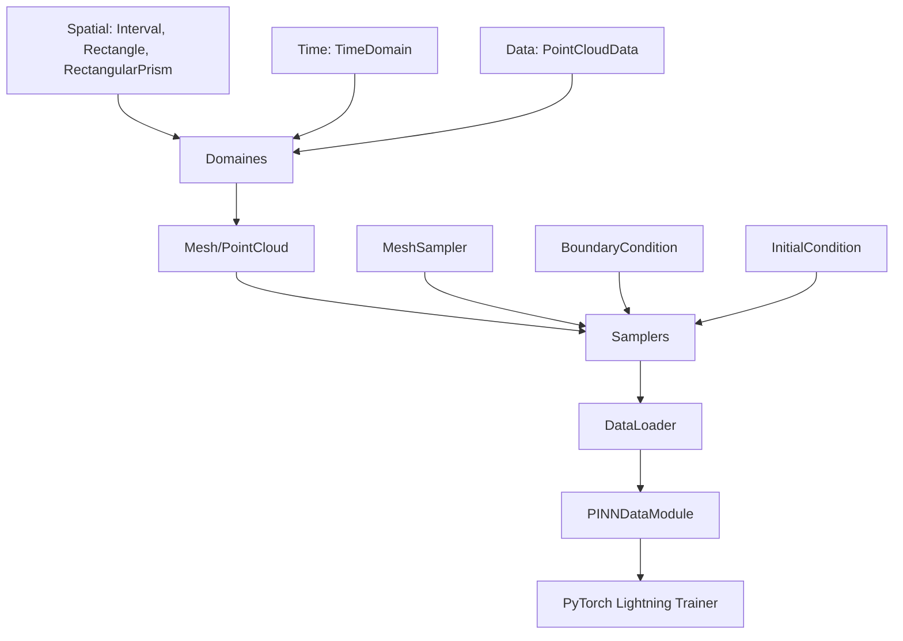

# Guide Complet du Module [data](file:///c:/Users/JL/OneDrive/Desktop/pinnstorch/pinn_project/part02/train02.py#11-44) de PINNsTorch

## 📋 Vue d'Ensemble

Le module `pinnstorch/data` est le **cœur du système de gestion des données** pour les Physics-Informed Neural Networks. Il fournit toute l'infrastructure nécessaire pour :
- Définir des domaines spatiaux et temporels
- Générer des maillages de points
- Échantillonner des points d'entraînement
- Appliquer des conditions aux limites et initiales
- Charger les données pour l'entraînement

---

## 🏗️ Architecture Globale



---

## 1️⃣ Dossier `domains/` - Définition des Domaines

### 📂 Fichiers
- `spatial.py` - Géométries spatiales (1D, 2D, 3D)
- `time.py` - Domaine temporel
- `point_cloud.py` - Structure de données pour nuages de points

---

### 🔹 **`spatial.py`** - Domaines Spatiaux

Trois classes pour définir des géométries spatiales :

#### **1. Classe `Interval` (1D)**

```python
Interval(x_interval=[0, 1], shape=[100])
```

**Rôle** : Définit un intervalle 1D discrétisé
- `x_interval` : Bornes [x_min, x_max]
- `shape` : Nombre de points dans l'intervalle

**Méthode clé** :
- `generate_mesh(t_points)` : Génère un maillage 1D répété pour chaque instant t
  - Retourne un array de forme (N_spatial, N_time, 1)

**Exemple** :
```python
interval = Interval(x_interval=[0, 10], shape=[50])
mesh = interval.generate_mesh(t_points=100)
# mesh.shape = (50, 100, 1)
```

---

#### **2. Classe `Rectangle` (2D)**

```python
Rectangle(x_interval=[0, 1], y_interval=[0, 1], shape=[50, 50])
```

**Rôle** : Définit un rectangle 2D
- `x_interval`, `y_interval` : Bornes en x et y
- `shape` : [N_x, N_y] points dans chaque direction

**Méthode clé** :
- `generate_mesh(t_points)` : Crée une grille 2D avec `meshgrid`
  - Retourne un array de forme (N_x × N_y, N_time, 2)

**Exemple** :
```python
rect = Rectangle(x_interval=[-1, 1], y_interval=[-1, 1], shape=[30, 30])
mesh = rect.generate_mesh(t_points=200)
# mesh.shape = (900, 200, 2)  # 30×30 points spatiaux
```

---

#### **3. Classe `RectangularPrism` (3D)**

```python
RectangularPrism(x_interval, y_interval, z_interval, shape=[20, 20, 20])
```

**Rôle** : Définit un prisme rectangulaire 3D
- Même logique que Rectangle mais avec dimension z
- Retourne un array de forme (N_x × N_y × N_z, N_time, 3)

---

### 🔹 **`time.py`** - Domaine Temporel

#### **Classe `TimeDomain`**

```python
TimeDomain(t_interval=[0, 1], t_points=100)
```

**Rôle** : Discrétise le temps
- `t_interval` : Intervalle temporel [t_start, t_end]
- `t_points` : Nombre de points temporels

**Méthode clé** :
- `generate_mesh(spatial_points)` : Crée un mesh temporel répété pour chaque point spatial
  - Retourne un array de forme (N_spatial, N_time, 1)

**Exemple** :
```python
time_domain = TimeDomain(t_interval=[0, 5], t_points=100)
time_mesh = time_domain.generate_mesh(spatial_points=500)
# time_mesh.shape = (500, 100, 1)
```

---

### 🔹 **`point_cloud.py`** - Structure de Données

#### **Dataclass `PointCloudData`**

```python
@dataclass
class PointCloudData:
    spatial: List[np.array]      # Liste de coordonnées spatiales [x, y, ...]
    time: np.array               # Coordonnées temporelles
    solution: Dict[str, np.array] # Solutions exactes {"u": ..., "v": ..., "p": ...}
```

**Rôle** : Conteneur pour données de nuages de points (utilisé avec `PointCloud`)

**Exemple d'utilisation** :
```python
data = PointCloudData(
    spatial=[x_coords, y_coords],  # x: (N, 1), y: (N, 1)
    time=[t_coords],                # t: (T, 1)
    solution={"u": u_exact, "v": v_exact}  # (N, T)
)
```

---

## 2️⃣ Dossier `mesh/` - Génération de Maillages

### 📂 Fichier : `mesh.py`

Contient deux classes principales : `Mesh` et `PointCloud`

---

### 🔹 **Classe de Base `MeshBase`**

Fournit des méthodes utilitaires partagées :

| Méthode | Description |
|---------|-------------|
| `domain_bounds()` | Calcule les bornes du domaine (lb, ub) |
| `on_lower_boundary(solution_names)` | Extrait les points sur la frontière inférieure |
| `on_upper_boundary(solution_names)` | Extrait les points sur la frontière supérieure |
| `on_initial_boundary(solution_names, idx)` | Extrait les points à l'instant initial (t=idx) |
| `collection_points(N_f, use_lhs)` | Génère N_f points de collocation (aléatoires ou LHS) |
| `flatten_mesh(solution_names)` | Aplatit le mesh en listes 1D |

---

### 🔹 **Classe `Mesh`**

**Usage** : Quand vous définissez explicitement les domaines spatial et temporel

```python
Mesh(
    spatial_domain=Rectangle(...),
    time_domain=TimeDomain(...),
    root_dir="./data",
    read_data_fn=my_read_function,
    lb=[x_min, y_min, t_min],  # Optionnel
    ub=[x_max, y_max, t_max]   # Optionnel
)
```

**Workflow** :
1. Appelle [read_data_fn(root_dir)](file:///c:/Users/JL/OneDrive/Desktop/pinnstorch/pinn_project/part02/train02.py#11-44) pour charger les solutions
2. Génère les maillages spatial et temporel via `generate_mesh()`
3. Stocke les bornes du domaine (lb, ub)

**Attributs** :
- `spatial_domain_mesh` : Array (N_spatial, N_time, spatial_dim)
- `time_domain_mesh` : Array (N_spatial, N_time, 1)
- `solution` : Dict {"u": array, "v": array, ...}

---

### 🔹 **Classe `PointCloud`**

**Usage** : Quand vous avez des données de nuage de points (données réelles ou synthétiques)

```python
PointCloud(
    root_dir="./data",
    read_data_fn=my_read_function,  # Doit retourner PointCloudData
    lb=None,
    ub=None
)
```

**Workflow** :
1. Appelle [read_data_fn(root_dir)](file:///c:/Users/JL/OneDrive/Desktop/pinnstorch/pinn_project/part02/train02.py#11-44) → retourne un objet `PointCloudData`
2. Extrait `spatial`, `time`, `solution`
3. Construit `spatial_domain_mesh` et `time_domain_mesh` en répétant les coordonnées

**Différence avec `Mesh`** :
- `Mesh` : Vous définissez la géométrie (Rectangle, Interval, etc.)
- `PointCloud` : Vous fournissez directement les coordonnées des points

**Exemple dans votre projet** :
```python
# Dans train.py et train02.py
mesh = PointCloud(root_dir=data_dir, read_data_fn=read_data_fn)
```

---

## 3️⃣ Dossier `sampler/` - Échantillonnage des Points

Les samplers extraient des sous-ensembles de points du mesh pour l'entraînement.

---

### 🔹 **Classe de Base `SamplerBase`**

Toutes les classes de sampler héritent de `SamplerBase`.

**Attributs communs** :
- `spatial_domain_sampled` : Points spatiaux échantillonnés
- `time_domain_sampled` : Points temporels échantillonnés
- `solution_sampled` : Solutions exactes échantillonnées

**Méthodes clés** :
- `sample_mesh(num_sample, flatten_mesh)` : Échantillonne `num_sample` points aléatoirement
- `convert_to_tensor(arrays)` : Convertit NumPy → PyTorch
- `loss_fn(inputs, loss, functions)` : Calcule la perte (appelle `_loss_fn` spécifique)
- `__len__()` : Nombre de points
- `__getitem__(idx)` : Accès indexé aux données

---

### 🔹 **Classe `MeshSampler`**

**Rôle** : Échantillonneur principal pour les points de solution et de collocation

```python
MeshSampler(
    mesh=my_mesh,
    idx_t=None,                    # Indice temporel spécifique (optionnel)
    num_sample=5000,               # Nombre de points à échantillonner
    solution=["u", "v"],           # Noms des variables de solution
    collection_points=["f_u", "f_v"],  # Points de collocation (résidus PDE)
    use_lhs=True                   # Utiliser Latin Hypercube Sampling
)
```

**Modes d'utilisation** :

#### **Mode 1 : Points de solution uniquement**
```python
sampler = MeshSampler(
    mesh=mesh,
    num_sample=5000,
    solution=["u", "v", "p"]
)
# Échantillonne 5000 points du mesh avec solutions exactes
```

#### **Mode 2 : Points de collocation uniquement** (résidus PDE)
```python
sampler = MeshSampler(
    mesh=mesh,
    num_sample=5000,
    collection_points=["f_u", "f_v"]
)
# Génère 5000 points aléatoires pour évaluer les résidus PDE
```

#### **Mode 3 : Points à un instant spécifique**
```python
sampler = MeshSampler(
    mesh=mesh,
    idx_t=100,  # À t = temps[100]
    solution=["u", "v"]
)
# Extrait tous les points spatiaux à l'instant t=100
```

**Méthode `_loss_fn`** :
- Si `collection_points` : Appelle [pde_fn()](file:///c:/Users/JL/OneDrive/Desktop/pinnstorch/pinn_project/train.py#43-75) pour calculer les résidus
- Si `solution` : Compare avec les solutions exactes
- Combine les deux pertes

---

### 🔹 **Classe `DirichletBoundaryCondition`**

**Rôle** : Impose des conditions de Dirichlet sur les frontières

```python
DirichletBoundaryCondition(
    mesh=my_mesh,
    solution=["u", "v"],
    num_sample=500,
    boundary_fun=None,  # Fonction optionnelle pour modifier les valeurs aux frontières
    discrete=False
)
```

**Workflow** :
1. Extrait les points sur les frontières supérieure et inférieure via `on_upper_boundary()` et `on_lower_boundary()`
2. Concatène ces points
3. Échantillonne `num_sample` points aléatoires parmi eux

**Exemple** : Fixer u=0 et v=0 aux bords d'un domaine

---

### 🔹 **Classe `PeriodicBoundaryCondition`**

**Rôle** : Impose des conditions périodiques (solution identique aux frontières opposées)

**Exemple** : Pour un domaine périodique comme un anneau

---

### 🔹 **Classe `InitialCondition`**

**Rôle** : Impose la condition initiale à t=0

```python
InitialCondition(
    mesh=my_mesh,
    num_sample=1000,
    solution=["u", "v"],
    initial_fun=None  # Fonction optionnelle pour définir u(x, t=0)
)
```

**Workflow** :
1. Extrait les points à t=0 via `on_initial_boundary()`
2. Si `initial_fun` est fourni, l'applique pour calculer la solution initiale
3. Échantillonne `num_sample` points

---

### 🔹 **Classe `DiscreteMeshSampler`**

**Rôle** : Pour les problèmes temporellement discrets (méthodes Runge-Kutta)

**Différence** : Ne considère pas le temps comme une variable continue, mais comme des pas discrets

---

## 4️⃣ Dossier `dataloader/` - Chargement des Données

### 📂 Fichier : `dataloader.py`

### 🔹 **Classe `PINNDataLoader`**

**Rôle** : DataLoader custom optimisé pour les PINNs

```python
PINNDataLoader(
    dataset=my_sampler,  # Un objet Sampler
    batch_size=None,     # Si None, tout le dataset en un batch
    ignore=False,        # Ignorer les batchs incomplets
    shuffle=False        # Mélanger les données
)
```

**Caractéristiques** :
- Plus rapide que `torch.utils.data.DataLoader` standard
- Supporte le batching et le shuffling
- Si `batch_size=None`, retourne tout le dataset d'un coup (typique pour PINNs)

**Méthodes** :
- `__iter__()` : Initialise l'itération
- `__next__()` : Retourne le prochain batch
- `__len__()` : Nombre de batchs

---

## 5️⃣ Fichier `pinn_datamodule.py`

### 🔹 **Classe `PINNDataModule`**

**Rôle** : Module de données PyTorch Lightning qui orchestre tous les dataloaders

```python
PINNDataModule(
    train_datasets=[sampler1, sampler2, ...],  # Liste de samplers pour l'entraînement
    val_dataset=val_sampler,                   # Un seul sampler pour validation
    test_dataset=test_sampler,
    pred_dataset=pred_sampler,
    batch_size=None,
    num_workers=0,
    pin_memory=False
)
```

**Workflow** :
1. `setup(stage)` : Initialise les dataloaders
   - Pour chaque `train_dataset`, crée un `PINNDataLoader`
   - Stocke les `loss_fn` associées dans `function_mapping`
2. `train_dataloader()` : Retourne les dataloaders d'entraînement
3. `val_dataloader()` : Retourne le dataloader de validation
4. `test_dataloader()`, `predict_dataloader()` : Idem pour test et prédiction

**Particularité** :
- Supporte **plusieurs datasets d'entraînement** simultanément (ex: points de solution + points de collocation + conditions aux limites)
- Chaque dataset a sa propre `loss_fn`

---

## 🔄 Flux de Données Complet

Voici comment tout s'assemble dans votre projet :

### **Étape 1 : Définir les domaines ou charger les données**

```python
# Option A: Avec domaines explicites
spatial = Rectangle(x_interval=[-1, 1], y_interval=[-1, 1], shape=[50, 50])
temp = TimeDomain(t_interval=[0, 1], t_points=100)
mesh = Mesh(spatial_domain=spatial, time_domain=temp, 
            root_dir="./data", read_data_fn=read_data_fn)

# Option B: Avec nuage de points (votre cas)
mesh = PointCloud(root_dir="./data", read_data_fn=read_data_fn)
```

### **Étape 2 : Créer des samplers**

```python
# Sampler pour points de solution
solution_sampler = MeshSampler(
    mesh=mesh,
    num_sample=5000,
    solution=["u", "v"]
)

# Sampler pour points de collocation (résidus PDE)
collocation_sampler = MeshSampler(
    mesh=mesh,
    num_sample=5000,
    collection_points=["f_u", "f_v"]
)

# Condition initiale
ic_sampler = InitialCondition(
    mesh=mesh,
    num_sample=1000,
    solution=["u", "v"]
)
```

### **Étape 3 : Créer le DataModule**

```python
data_module = PINNDataModule(
    train_datasets=[solution_sampler, collocation_sampler, ic_sampler],
    val_dataset=MeshSampler(mesh=mesh, solution=["u", "v", "p"])
)
```

### **Étape 4 : Entraîner avec PyTorch Lightning**

```python
trainer = Trainer(max_epochs=10000, ...)
trainer.fit(model, datamodule=data_module)
```

---

## 📊 Exemple Concret : Votre Projet

Dans [train.py](file:///c:/Users/JL/OneDrive/Desktop/pinnstorch/pinn_project/train.py) et [train02.py](file:///c:/Users/JL/OneDrive/Desktop/pinnstorch/pinn_project/part02/train02.py) :

### **1. Fonction [read_data_fn](file:///c:/Users/JL/OneDrive/Desktop/pinnstorch/pinn_project/part02/train02.py#11-44)**

```python
def read_data_fn(root_path):
    # Charge les données
    x, y, t = ...  # Coordonnées
    u, v, p = ...  # Solutions
    
    return PointCloudData(
        spatial=[x, y],
        time=[t],
        solution={"u": u, "v": v, "p": p}
    )
```

### **2. Configuration [config.yaml](file:///c:/Users/JL/OneDrive/Desktop/pinnstorch/pinn_project/configs/config.yaml)**

```yaml
mesh:
  _target_: pinnstorch.data.PointCloud
  root_dir: ${paths.data_dir}
  read_data_fn: ???  # Sera rempli par pinnstorch.train()

train_datasets:
  - mesh_sampler:
      _target_: pinnstorch.data.MeshSampler
      num_sample: 5000
      solution: [u, v]          # Points avec solutions exactes
      collection_points: [f_u, f_v]  # Points pour résidus PDE
```

### **3. Instanciation automatique par Hydra**

```python
pinnstorch.train(cfg, read_data_fn=read_data_fn, pde_fn=pde_fn, output_fn=output_fn)
```

Cette fonction :
1. Instancie `PointCloud` avec [read_data_fn](file:///c:/Users/JL/OneDrive/Desktop/pinnstorch/pinn_project/part02/train02.py#11-44)
2. Crée les `MeshSampler` configurés
3. Assemble le `PINNDataModule`
4. Lance l'entraînement

---

## 🎯 Résumé des Composants

| Composant | Rôle |
|-----------|------|
| **`Interval`, `Rectangle`, `RectangularPrism`** | Définissent la géométrie spatiale |
| **`TimeDomain`** | Définit la discrétisation temporelle |
| **`PointCloudData`** | Structure de données pour nuages de points |
| **`Mesh`** | Génère des maillages à partir de domaines définis |
| **`PointCloud`** | Génère des maillages à partir de points arbitraires |
| **`MeshSampler`** | Échantillonne des points de solution et/ou collocation |
| **`DirichletBoundaryCondition`** | Impose des conditions aux frontières |
| **`InitialCondition`** | Impose la condition initiale |
| **`PINNDataLoader`** | DataLoader optimisé pour PINNs |
| **`PINNDataModule`** | Orchestre tous les dataloaders (PyTorch Lightning) |

---

## 💡 Points Clés à Retenir

1. **Deux approches** :
   - `Mesh` : Géométrie définie explicitement (Interval, Rectangle, etc.)
   - `PointCloud` : Points arbitraires (vos données réelles ou synthétiques)

2. **Échantillonnage flexible** :
   - Points de solution (comparaison avec données exactes)
   - Points de collocation (évaluation des résidus PDE)
   - Conditions aux limites et initiales

3. **Latin Hypercube Sampling (LHS)** :
   - Utilisé pour les points de collocation
   - Meilleure couverture du domaine que le sampling aléatoire uniforme

4. **Intégration PyTorch Lightning** :
   - `PINNDataModule` gère automatiquement train/val/test/predict
   - Supporte plusieurs datasets d'entraînement avec différentes loss functions

5. **Configuration Hydra** :
   - Tout est configurable via YAML
   - Instantiation automatique des classes avec `_target_:`
